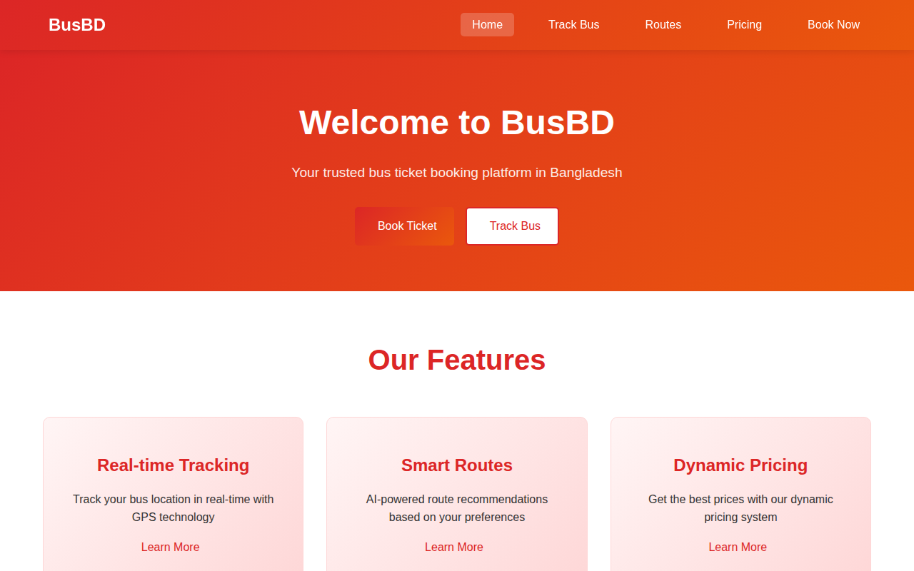
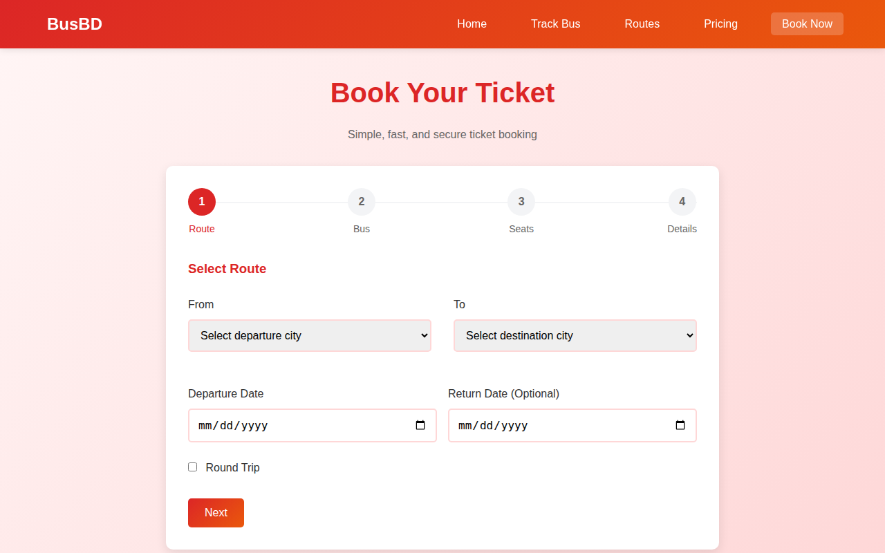
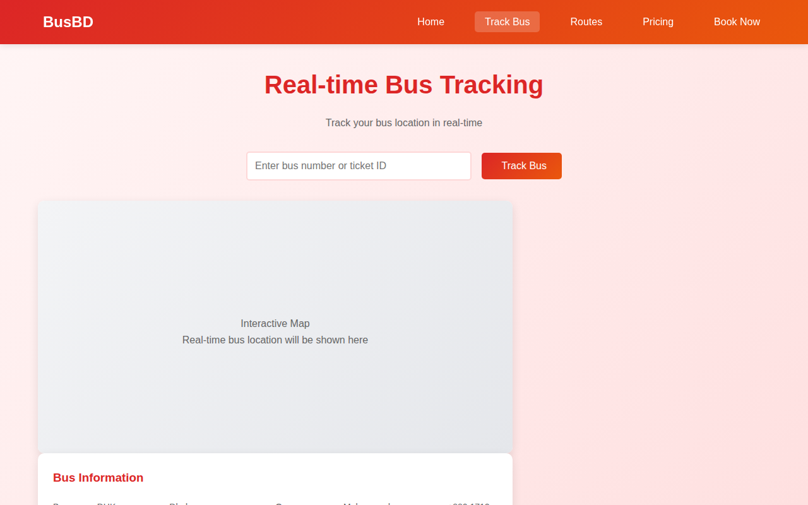
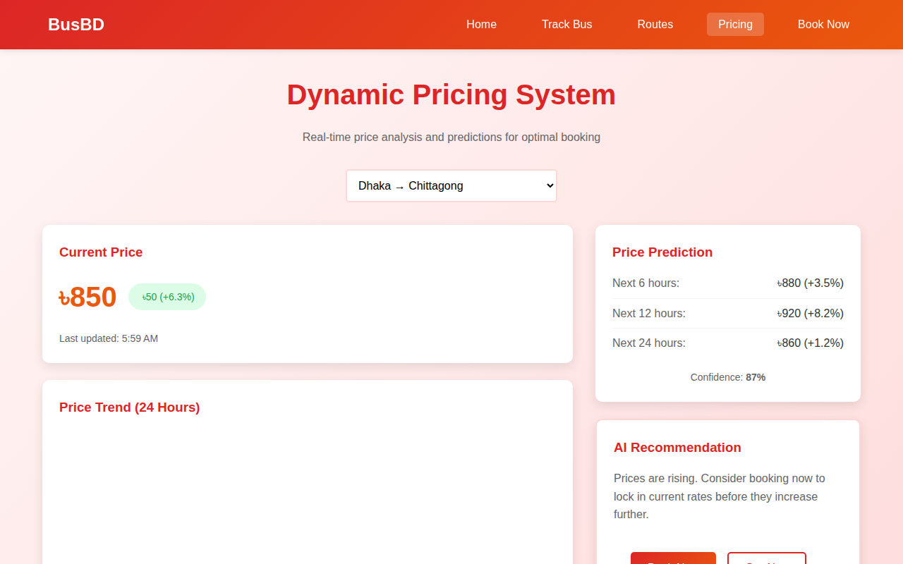
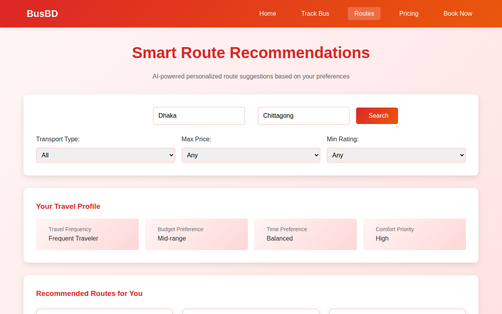

# busbd-smart-ticket-booking-system

# 🚌 BusBD — Bangladesh Bus Ticket Booking Platform

A full-stack bus ticketing web application built for Bangladesh, featuring real-time tracking, dynamic pricing, and multi-step seat booking.

---

## 🖥️ Screenshots

### Home Page


### Book Ticket


### Real-time Bus Tracking


### Dynamic Pricing


### Smart Routes


---

## ✨ Features

- **Multi-step Ticket Booking** — Route selection, bus choice, interactive seat map, passenger details
- **Real-time Bus Tracking** — GPS-based live location with journey progress
- **Dynamic Pricing System** — Demand-based pricing with 24-hour price trend chart
- **Smart Route Recommendations** — AI-powered suggestions based on travel preferences
- **Responsive Design** — Works on both desktop and mobile

---

## 🛠️ Tech Stack

| Layer | Technology |
|-------|-----------|
| Frontend | HTML5, CSS3, JavaScript |
| Backend | PHP |
| Database | MySQL |
| Icons | Font Awesome 6 |

---

## 📁 Project Structure

```
BusBD/
├── index.html          # Home page
├── booking.html        # Multi-step booking form
├── tracking.html       # Real-time bus tracking
├── pricing.html        # Dynamic pricing dashboard
├── recommendations.html# Route recommendations
├── style.css           # Global styles
├── main.js             # Core JS logic
├── booking.js          # Booking flow logic
├── tracking.js         # Tracking page logic
├── pricing.js          # Pricing chart logic
├── database.php        # DB connection
└── database.sql        # Database schema
```

---

## ⚙️ Setup & Run Locally

1. Clone the repository
   ```bash
   git clone https://github.com/ahidnahid/BusBD.git
   ```

2. Move the project folder to your server root (e.g. `htdocs` for XAMPP)

3. Import the database
   - Open **phpMyAdmin**
   - Create a new database named `busbd`
   - Import `database.sql`

4. Update DB credentials in `database.php`
   ```php
   $host = "localhost";
   $user = "root";
   $password = "";
   $database = "busbd";
   ```

5. Start Apache & MySQL from XAMPP/WAMP, then open:
   ```
   http://localhost/BusBD/index.html
   ```

---

## 👨‍💻 Author

**Md. Ahidul Islam**
B.Sc in CSE — Daffodil International University

[](https://github.com/ahidnahid)
[](https://linkedin.com/in/md-ahidul-islam-41aa913bb)
